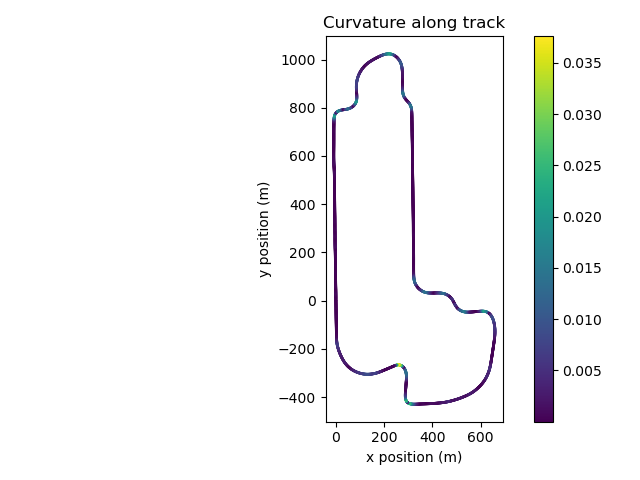

# Racetrack Curvature

_Jason Klein. Oct. 29, 2024_

Converts lat/long coordinates of the Indy 500 racetrack to the ENU [local tangent plane](https://en.wikipedia.org/wiki/Local_tangent_plane_coordinates) reference frame, which has units of meters. Then numerically computes the curvature at each point and visualizes the result.

## Why?

As part of speccing the steering system, Selena wanted to know the minimum radius of a turn on the competition track and asked me if I happened to know. I didn't, but I did remember that the [2023 driver dash I wrote](https://github.com/cornellev/driverdash) had access to a file called `Indy500.json` that had latitude and longitude coordinates of the actual path traveled during competitio